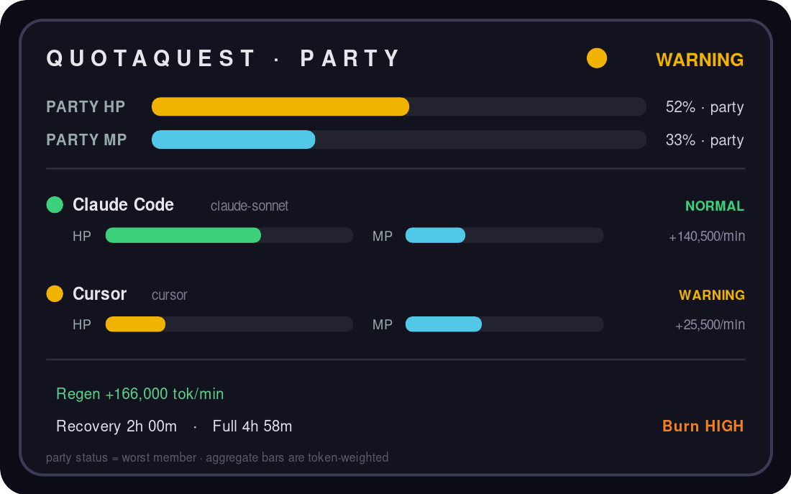
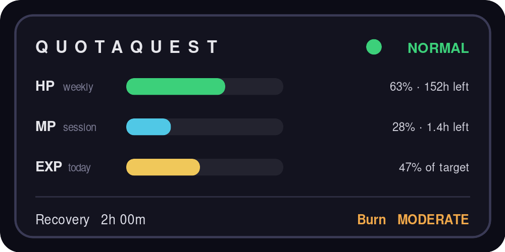
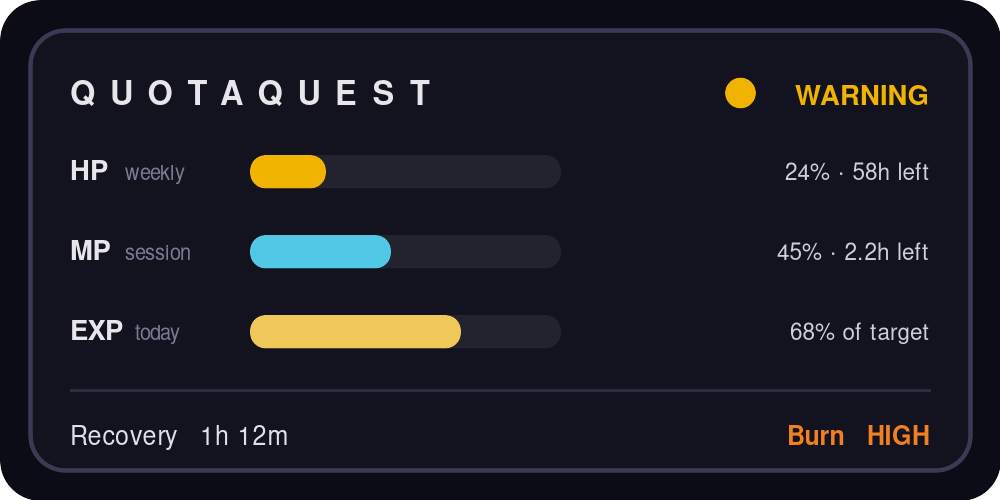
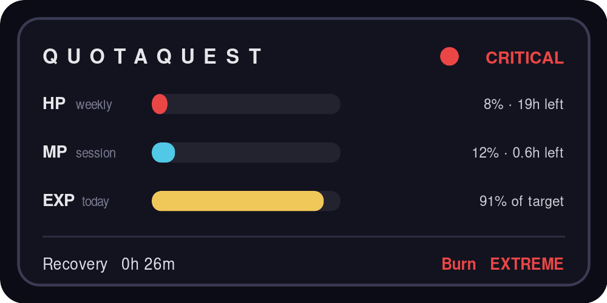

# ⚡ QuotaQuest

> **Turn your AI quota into an MMORPG status bar.** HP, MP, EXP and a recovery timer —
> always on top, half-transparent, sitting on your desktop. Stop reading `/usage`. Start
> watching your HP.



<p align="center">
  <code>HP = weekly budget</code> ·
  <code>MP = 5-hour session</code> ·
  <code>EXP = today</code> ·
  <code>⟳ Recovery timer</code> ·
  <code>🔥 Burn rate</code> ·
  <code>NORMAL / WARNING / CRITICAL</code>
</p>

---

## Problem

Claude Code (and Cursor, Copilot, Windsurf) moved to **metered, depletable budgets**.
Claude runs **two clocks at once** — a 5-hour rolling window *and* a weekly cap — and
neither is visible while you work. So heavy users:

- hit the wall **mid-task** with no warning,
- type `/usage` ten times a day like an anxiety tic,
- and have **no feel** for how fast they're burning through the week.

Existing monitors are accurate but look like spreadsheets. Checking your quota is a chore.

## Solution

**QuotaQuest** reads the usage logs Claude Code already writes locally and renders
them as a game HUD you actually *want* to glance at:

| Element | Meaning |
|---------|---------|
| **HP** | Weekly budget remaining (the health you protect) |
| **MP** | Current 5-hour session window remaining (mana you spend) |
| **EXP** | Today's usage (the grind) |
| **⟳ Recovery** | Predicted time until your session window frees up |
| **🔥 Burn** | Consumption speed — LOW / MODERATE / HIGH / EXTREME |
| **Status** | NORMAL · WARNING · CRITICAL (drives the HP bar color) |

It's **local-only** (no account, no cloud), **lightweight**, **always-on-top**, and
**half-transparent** — perfect for a second monitor or an OBS stream.

## Screenshot

Three live states — the HP bar recolors as you burn through the week (rendered via Rainmeter on Windows):

| NORMAL | WARNING | CRITICAL |
|---|---|---|
|  |  |  |

```
⚡ QUOTAQUEST                 NORMAL ●
HP  ▓▓▓▓▓▓▓▓▓▓▓▓▓▓░░░░░░  63%   152/240 hrs
MP  ▓▓▓▓▓░░░░░░░░░░░░░░░  28%   3.6/5.0 hrs
EXP ▓▓▓▓▓▓▓▓▓░░░░░░░░░░░  47%   today
⟳ Recovery 2h 00m              🔥 Burn MODERATE
```

## How it works

```
~/.claude/projects/*.jsonl  ──▶  Node monitor  ──▶  state.json  ──▶  Rainmeter skin
   (Claude Code logs)            (parse+compute)     (1 file)         (HP/MP/EXP HUD)
```

Two parts, one file between them. The monitor aggregates your token usage over the
5-hour and 7-day windows, computes burn rate / recovery / status, and writes a tiny
`state.json`. The Rainmeter skin reads that file and draws the bars. Either side can be
swapped without touching the other. See [`docs/ARCHITECTURE.md`](docs/ARCHITECTURE.md).

Data sources (auto-detected, in order): **ccusage** → **direct JSONL parse** → **demo**.

## Installation

**Requirements:** Windows · [Rainmeter](https://www.rainmeter.net) · [Node.js 18+](https://nodejs.org)

```powershell
# 1. Clone
git clone https://github.com/you/quotaquest.git
cd quotaquest

# 2. Install (copies the skin into Rainmeter, points the monitor at it)
powershell -ExecutionPolicy Bypass -File scripts\install.ps1 -Plan max20x

# 3. In Rainmeter: Refresh All -> load QuotaQuestHUD\QuotaQuestHUD.ini

# 4. Start the monitor (keeps the HUD live)
scripts\start-monitor.bat
```

No Claude logs yet, or just want to see it? Run **demo mode**:

```powershell
scripts\start-monitor-demo.bat
```

**Calibrate your plan:** edit `monitor/config.json` → set `"plan"` to `pro` / `max5x` /
`max20x`, and tune the token caps to match your real limits (they're approximate by design).

## Configuration (`monitor/config.json`)

| Key | What it does |
|-----|--------------|
| `plan` | `pro` · `max5x` · `max20x` · `custom` — selects the cap set |
| `plans.*.weeklyTokens` | weekly budget → drives **HP** |
| `plans.*.sessionTokens` | 5-hour budget → drives **MP** |
| `plans.*.dailyTargetTokens` | soft daily target → drives **EXP** |
| `unit` | `hrs` or `tok` for the on-bar numbers |
| `thresholds` | `warning` / `critical` % of HP that flip the status |
| `intervalSeconds` | how often the monitor refreshes (default 30) |

## Multi-AI party (v2)

Connect more than one AI and QuotaQuest renders them as an RPG **party** — each model is a
member with its own HP / MP / EXP, **Regen** (refill rate) and **FullRecover** (back-to-100%),
plus a party-wide aggregate. Party status = the worst member, so one tool running low flips
the whole party to WARNING/CRITICAL.


Add an AI by enabling its adapter in `monitor/config.json` (`docs/ADAPTERS.md`). Claude Code
ships working; Cursor / Copilot / Windsurf are stubbed seams ready to implement.

## Make your own bar (Theme Maker)

No code, a few clicks: open `tools/theme-maker/index.html`, pick your colors, watch the HUD update live, then export a **Rainmeter theme (.inc)**, a **JSON theme**, or a **share code** that themes the web/OBS HUD instantly (`renderers/web/index.html?theme=…`). One format, every renderer — see `docs/THEME_FORMAT.md`. Your bar, your style.

## Themes & skins

Swap the look by changing **one line** in `skin/QuotaQuestHUD/Variables.inc`
(`@includeTheme=...`). Bundled: **Default · Minimal · Cyberpunk**. Bring your own `.inc` or a
whole new `.ini` layout — every skin just reads `state.json`. See `docs/SKINNING.md`.

## Extend it — EnergyHUD Engine

Under QuotaQuest is **EnergyHUD Engine**: a reusable core for *any* AI-usage/quota/cost tool.
It normalizes events, does the windowing + burn/regen/recovery math, and writes one versioned
`state.json`. Two open seams:

- **Adapters** (data in) — add any AI tool with one `fetch()` → `docs/ADAPTERS.md`
- **Renderers** (UI out) — read `state.json`, draw anything → `docs/RENDERERS.md`.
  Ships a reference **web renderer** (`renderers/web/`) that doubles as a transparent **OBS** overlay.

The contract is `docs/STATE_SCHEMA.md`; the vision is `docs/ENGINE.md`.

## Roadmap

- [ ] **v0.1 (this MVP):** Windows · Rainmeter · Claude Code · HP/MP/EXP/Recovery/Burn/Status
- [x] **Themes:** swappable skins (Cyberpunk, FF-classic, Minimal, Streamer-overlay)
- [ ] **Live countdown:** client-side ticking recovery timer between monitor writes
- [ ] **Status FX:** WARNING pulse / CRITICAL blink + optional sound
- [~] **Multi-tool adapters:** registry + stubs shipped; implement fetch() per tool Cursor, GitHub Copilot, Windsurf
- [ ] **Tray packaging:** one-click installer, autostart, no terminal window
- [ ] **Cross-platform:** Electron/Tauri build for macOS & Linux
- [ ] **Stream kit:** transparent-background OBS source + alert webhooks

## Contributing

Issues and PRs welcome — especially new skins/themes and tool adapters. MIT licensed.

## Why this exists

Plenty of tools show your usage. None make it *fun*. This one turns "am I going to run
out?" from an anxiety into a glanceable game. Built for Claude Code heavy users, vibe
coders, and AI-tool streamers.


## Disclaimer

QuotaQuest is an independent project. It is **not affiliated with, sponsored by, or endorsed by Anthropic**. "Claude" and "Claude Code" are trademarks of Anthropic, PBC; "Rainmeter" is a trademark of its respective owner. These names are used nominatively to describe compatibility only. See `NOTICE` and `THIRD-PARTY.md`.

## License

[MIT](LICENSE)
