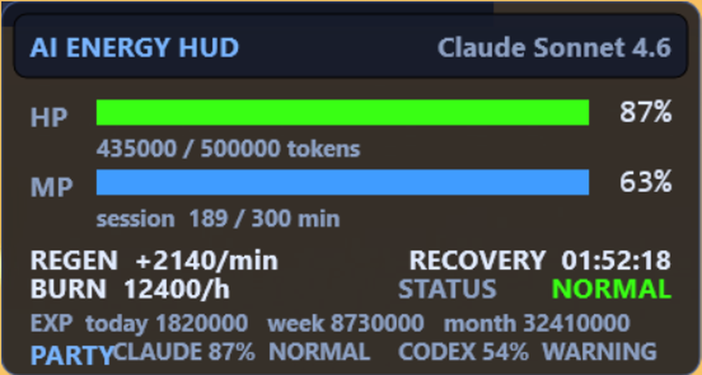
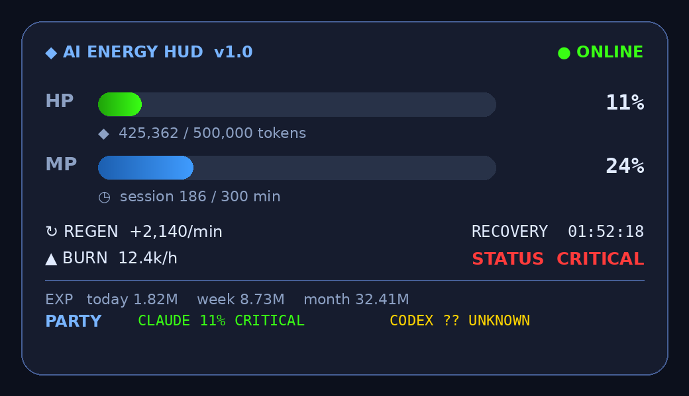
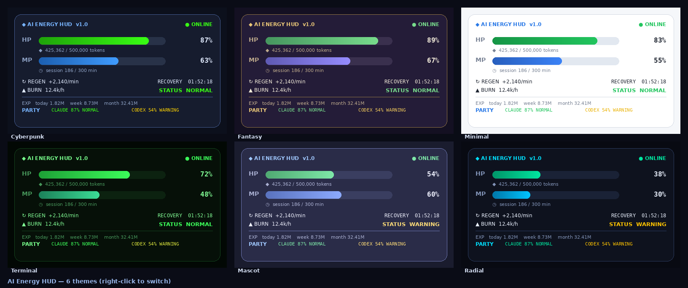
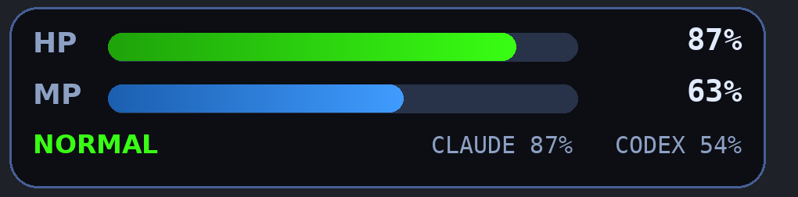
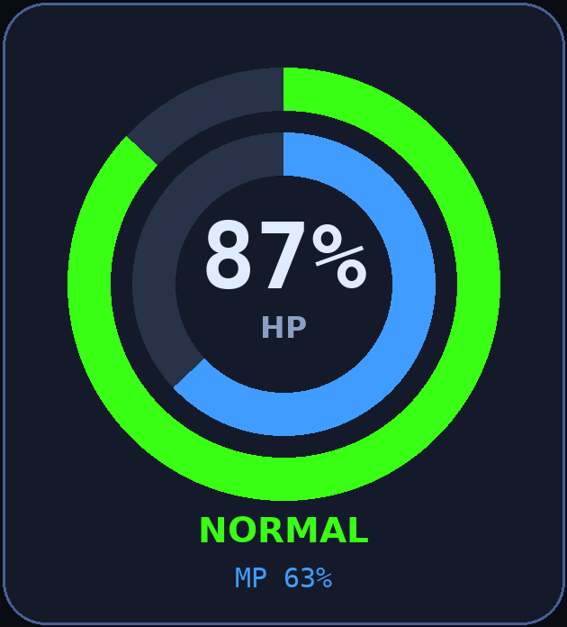

<div align="center">

# ⚡ AI Energy HUD

**AI Usage, Gamified.**

An MMORPG-style desktop HUD that turns your AI coding usage into HP / MP bars.
Built for Claude Code, Codex & the multi-agent era — always on top, semi-transparent, Windows-native.

`Rainmeter` · `Node.js` · `Zero-dependency` · `Local-only` · `MIT`

</div>

---

## Problem

In 2025–2026 every major AI coding tool moved to **opaque token / credit billing**:

- **Claude Code** describes limits in *relative* terms — you can't see real headroom.
- **Codex** has a documented bug where background tokens get misclassified as *"Other"* and **silently drain your weekly quota** ([openai/codex #15336](https://github.com/openai/codex/issues/15336)).
- **GitHub Copilot** switched to usage-based AI Credits (June 2026) and power users saw bills jump **10×–100×**.

The result: developers code with a constant, low-grade anxiety — *"how much do I have left, and when does it come back?"* — and have to **stop and run a command** to find out. Existing trackers (ccusage, tokscale, TokenTracker) are CLIs, web dashboards, or macOS-only menu bar apps. **Nothing sits on a Windows desktop and lets you *feel* your remaining energy at a glance.**

## Solution

AI Energy HUD reads your **local** usage logs and renders them as a game HUD:

- **HP** = remaining Claude Code budget (turns green → yellow → red as you burn down)
- **MP** = remaining 5-hour session window
- **Regen** = tokens recovered / min · **Recovery Timer** = ETA to full · **Burn Rate** = consumption speed
- **EXP** = today / week / month usage
- **Status** = `NORMAL` / `WARNING` / `CRITICAL`
- **🆕 Party HP** = Claude **and** Codex shown side-by-side like RPG party members, so you instantly spot which agent is *silently* draining MP. Unknown Codex token data shows as `?? UNKNOWN` instead of a false-safe bar.

Always-on-top, semi-transparent, draggable, and OBS-overlay friendly for streamers.

## Screenshot

<div align="center">



*Actual screenshot of the skin running on Windows (Rainmeter). Below: critical-state and theme mockups.*

*When you run low, the bar and status flip to red:*



**Six built-in themes — right-click to switch:**



**Compact overlay for streamers (`Compact.ini`) — drop onto an OBS scene:**



**Radial gauges (`Radial.ini`):**



</div>

> 🔔 The monitor fires a desktop notification the moment your status drops to **WARNING** or **CRITICAL** (edge-triggered, with a cooldown) — configurable under `notify` in `config.json`.

*(Run `node index.js --mock` for a live demo without touching real logs.)*

## How it works

```
~/.claude/projects/**/*.jsonl  ─┐
~/.codex/sessions/**/*.jsonl   ─┤→ Node monitor → state.json → Rainmeter skin
                                 (read-only, 5s)   (atomic)     (1s refresh)
```

No API keys. No network calls. No telemetry. It only **reads** the same local JSONL files that `ccusage` reads, then writes a small `state.json` the skin renders.

## Installation

**Requirements:** Windows 10/11 · [Rainmeter](https://www.rainmeter.net) · [Node.js 16+](https://nodejs.org)

### Fastest: install the packaged skin
Double-click **`dist/AIEnergyHUD_1.0.0.rmskin`** → Rainmeter's installer opens → **Install**. The HUD appears with all six themes. Then start the monitor (below) so the bars reflect your real usage.

### Quick start (from source)
```powershell
# 1. Clone
git clone https://github.com/151Me/ai-energy-hud.git
cd ai-energy-hud/release

# 2. One-click installer (copies skin, seeds config, starts monitor)
install\install.bat

# — or manually —
cd monitor
copy config.example.json config.json     # edit hpMaxTokens to calibrate your plan
node index.js                            # live    (reads your logs)
node index.js --mock                     # demo    (no logs needed)
```

Then in Rainmeter: **Manage → refresh → load `AIEnergyHUD.ini`**. Drag it anywhere; right-click for options.

### Calibration
Anthropic/OpenAI report limits relatively, so set `hpMaxTokens` in `config.json` to whatever budget a *full* HP bar should mean for your plan (e.g. Pro ≈ 44k/window, Max20 ≈ 220k). The HUD is intentionally user-tunable so it never breaks when a vendor changes wording.

## Roadmap

- [x] **v1.0 — MVP:** Windows Rainmeter HUD, HP/MP/Regen/Recovery/Burn/Status, Claude + Codex party HP, mock mode
- [x] **v1.1:** `.rmskin` one-click package · theme switcher (Cyberpunk / Fantasy / Minimal / Terminal / Mascot / Radial)
- [x] **v1.2:** compact OBS overlay variant (`Compact.ini`) · Cursor & Copilot in the party via `manualPercent` adapter
- [x] **v1.3:** true radial-gauge layout (`Radial.ini`) · desktop notifications on `WARNING`/`CRITICAL` (Win/mac/Linux) · standalone-exe build (Node SEA, `install/build-exe.ps1`)
- [ ] **v1.4:** native Cursor/Copilot log parsing · per-agent thresholds · usage history sparkline
- [ ] **v2.0:** cross-platform companion (Wallpaper Engine / Electron) · optional opt-in leaderboard

## Contributing
Issues and PRs welcome. The schema contract between monitor and skin is documented in [`Architecture.md`](Architecture.md). Vendor-format changes should only require edits to `monitor/src/parsers.js`.

## License
[MIT](LICENSE)

---
<div align="center"><sub>Made for everyone who's ever watched their AI budget vanish without warning.</sub></div>
